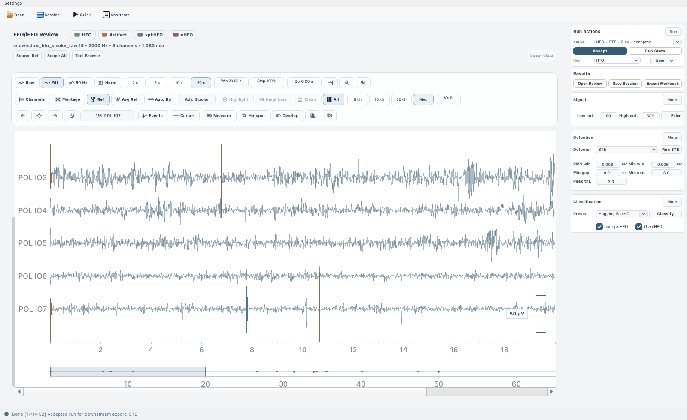
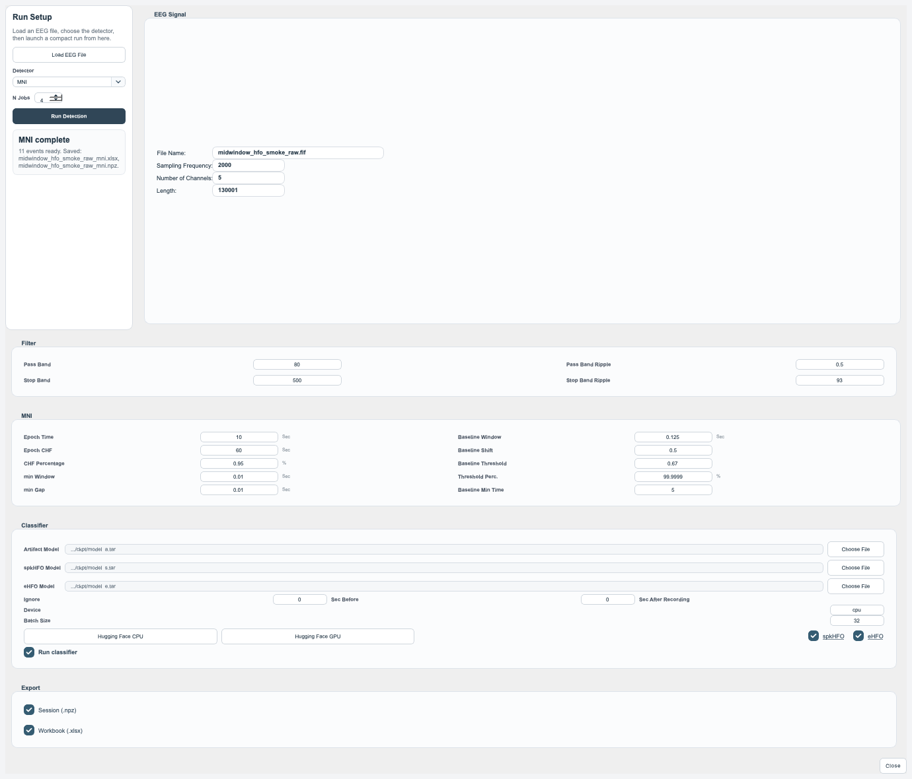
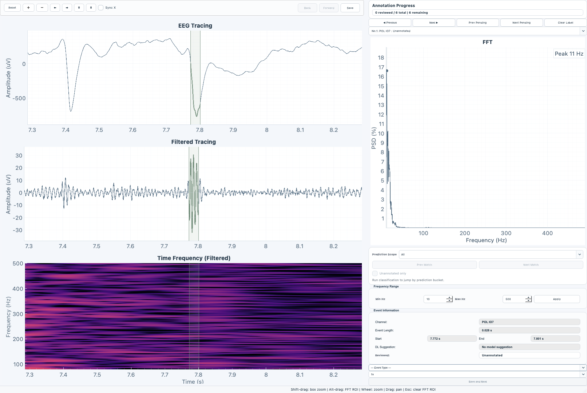
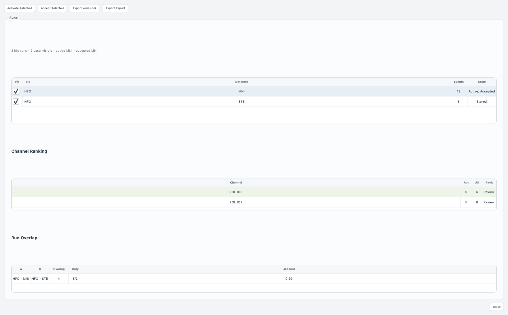

# PyHFO 3.0.1 User Manual

This manual is for day-to-day PyHFO use. It is written as an operator guide rather than a developer note. The goal is to answer four practical questions:

1. How do I open data and start working?
2. Which controls matter in the main window?
3. How do I run HFO or spindle workflows safely?
4. What files does PyHFO save and export?

## Document Map

If you are using this manual during real work, the most useful sections are:

- Section 5 if you are new to the application and want a basic screen tour.
- Section 10 if you want the normal HFO workflow.
- Section 11 if you are doing spindle review.
- Section 13 if you want the Quick Detection workflow.
- Section 14 if you are annotating events.
- Section 15 if you are saving or restoring a case.
- Section 16 if you are exporting reports and workbooks.
- Section 17 if you are working with more than one run in the same case.
- Section 20 if something is not working as expected.

## Operator Checklist

For a routine case, PyHFO is safest when you follow this order:

1. Open the EEG file.
2. Confirm sampling frequency, channel count, and duration.
3. Confirm the biomarker mode.
4. Save a session after the first meaningful processing step.
5. Export only after you know which run is the accepted run.

If you are training someone new, teach them these habits first:

- never annotate before checking the biomarker mode
- never move a `.pybrain` file without its `.pybrain.data` folder
- never send a report HTML file without its `*_report_files` folder
- never assume the active run and accepted run are the same

## Figure Provenance

All screenshots in this manual were regenerated on April 4, 2026 from the current `main` branch code for `PyHFO 3.0.1`.

Use this as the trust rule for the figures:

- the screenshots in this manual are current UI captures, not scans from the legacy PDF manual
- the HFO, Quick Detection, annotation, and run-comparison figures use a real EDF-derived excerpt from `SM_B_ave.edf`
- the capture workflow uses fixed documentation window sizes so each figure reflects the current control layout rather than a default OS window size
- the figures are meant to show the current control layout and workflow state, not to provide clinical interpretation

## 1. What PyHFO Is

PyHFO is a desktop EEG review application for:

- HFO detection and review
- spindle detection and review
- related event classification workflows
- session persistence
- report and workbook export

The current `3.0.1` release centers around one unified workspace instead of the older single-purpose EDF detector layout.

## 2. Supported Inputs And Outputs

### Input EEG files

PyHFO can open:

- `EDF` EEG files: `.edf`
- BrainVision EEG files: `.vhdr`, `.eeg`, `.vmrk`
- `FIF` EEG files: `.fif`
- compressed FIF EEG files: `.fif.gz`

### Format-specific notes

Use these rules when choosing files:

- For `EDF`, pick the `.edf` file directly.
- For BrainVision, open the `.vhdr` file. PyHFO expects the matching `.eeg` and `.vmrk` files to be present beside it.
- For `FIF`, open the `.fif` file directly.
- For compressed FIF, open the `.fif.gz` file directly.

If a BrainVision case fails to load, check these first:

- the `.vhdr`, `.eeg`, and `.vmrk` files all exist
- the filenames still match each other
- they were not separated into different folders

### Session files

PyHFO can save and load:

- `.pybrain`
- `.npz`

Important detail:

- A `.pybrain` session is not a single file.
- PyHFO writes the main `.pybrain` file plus a companion folder named `<session>.pybrain.data`.
- Keep them together when moving, copying, archiving, or sharing a session.

### Export files

PyHFO can export:

- Excel workbook: `.xlsx`
- event table: `.csv`
- HTML report: `.html`
- waveform snapshot: `.png`
- report asset folder: `*_report_files/`

### Disk layout examples

Typical saved session:

```text
case01.pybrain
case01.pybrain.data/
```

Typical report export:

```text
case01_report.html
case01_report_files/
```

Typical workbook export:

```text
case01_clinical_summary.xlsx
```

## 3. Biomarker Modes

PyHFO supports three biomarker modes from the biomarker selector in the main window.

### HFO

Use `HFO` for the full HFO workflow:

- filtering
- detector configuration
- HFO detection
- artifact / spkHFO / eHFO classification
- annotation
- workbook and report export

### Spindle

Use `Spindle` for spindle workflows based on `YASA`.

This mode supports:

- spindle filter settings
- YASA detector settings
- artifact and spike review support
- annotation
- session save and export

### Spike

Use `Spike` when you want a review-oriented workflow for spike-related events.

Current expectation for `Spike` mode:

- session and review workflows are available
- automated spike detection is not the main supported path in this release

## 4. Installation And Launch

### macOS standalone release

1. Download the release from GitHub Releases.
2. Unzip the downloaded archive if needed.
3. If macOS warns about the app or the DMG, clear quarantine:

```bash
xattr -cr PyHFO-3.0.1-macos-arm64.dmg
```

4. Open the DMG.
5. Drag `PyHFO.app` into `Applications`.
6. Open `PyHFO.app` from `Applications`.

If macOS still blocks the app:

1. Right-click the app.
2. Choose `Open`.
3. Confirm the security prompt.

### Run from source

PyHFO is currently developed around Python `3.9`.

```bash
git clone https://github.com/roychowdhuryresearch/pyHFO.git
cd pyHFO
python3.9 -m venv .venv
source .venv/bin/activate
pip install --upgrade pip
pip install -r requirements.txt
python main.py
```

## 5. First Launch: What You See

The main window gives you three immediate entry points:

- `Open File`
- `Load Detection`
- `Quick Detection`

These mean:

- `Open File`: open a new EEG file from disk.
- `Load Detection`: load an existing saved PyHFO session from `.pybrain` or `.npz`.
- `Quick Detection`: open the smaller single-EEG-file HFO workflow.

After loading an EEG file, the main workspace exposes:

- waveform controls
- channel controls
- filter controls
- detector controls
- classifier controls
- run statistics
- annotation
- export actions

Current main workspace in a completed HFO review state:



This figure shows the current `3.0.1` main workspace after HFO detection and accepted-run selection on a five-channel HFO review window derived from `SM_B_ave.edf`, captured at the fixed manual layout size.

## 5A. First-Time Startup Scenarios

There are three normal ways to begin.

### Scenario A: new case

Use this when you have a new EEG file and no prior PyHFO session.

1. Click `Open File`.
2. Load the EEG file.
3. Confirm the metadata panel is correct.
4. Choose the biomarker mode.
5. Continue with filtering and detection.

### Scenario B: continuing an unfinished case

Use this when you already saved a PyHFO session.

1. Click `Load Detection`.
2. Choose the `.pybrain` file or legacy `.npz`.
3. Wait for waveform initialization to finish.
4. Confirm the correct biomarker mode and run state were restored.

### Scenario C: fast one-off HFO pass

Use this when you only want a single detector run and exports, not the full multi-run workspace.

1. Click `Quick Detection`.
2. Load the EEG file inside the Quick Detection dialog.
3. Select a detector.
4. Run and export.

## 5B. Action Paths And Expected Reactions

This section is intentionally explicit. It describes the operator path through the UI and the reaction you should expect from PyHFO after each action.

### Path: open a new EEG file

Operator path:

1. Top toolbar -> `Open File`
2. File chooser -> select `.edf`, `.vhdr`, `.fif`, or `.fif.gz`
3. Confirm the dialog

Expected reaction:

- the EEG file name appears in the information panel
- sampling frequency, channel count, and signal length populate
- the waveform area is no longer empty
- navigation controls become active
- filter and detector controls become available for supported biomarker modes
- the message/log panel reports that the EEG file loaded

If this does not happen:

- the file may not have loaded
- the file format may be unsupported or incomplete
- the log panel usually contains the first useful error message

### Path: restore a saved session

Operator path:

1. Top toolbar -> `Load Detection`
2. Select `.pybrain` or legacy `.npz`
3. Confirm the dialog

Expected reaction:

- waveform state is rebuilt
- biomarker mode switches to the saved mode
- saved runs reappear
- accepted run state is restored if one existed
- annotation becomes available again if the saved run contains events

If this does not happen:

- check whether the `.pybrain.data` folder still exists beside the `.pybrain` file
- check whether the session points to an EEG file path that still exists

### Path: switch biomarker mode

Operator path:

1. Find the biomarker selector near the top of the workspace
2. Choose `HFO`, `Spindle`, or `Spike`

Expected reaction:

- detector choices change to match that biomarker mode
- classifier controls may change
- existing visible run context may change
- the workflow message updates to reflect the selected mode

Important reaction to understand:

- `Spike` mode is review-oriented, so some automated detection controls may stay disabled
- `Spindle` mode depends on `YASA`, so spindle detection can stay unavailable if `YASA` is missing

## 6. Main Window Anatomy

This section explains the main workspace by screen area.

### 6.1 Top toolbar and startup actions

The main toolbar contains:

- `Open File`
- `Load Detection`
- `Quick Detection`
- `Shortcuts`

Typical use:

- Start with `Open File` for a new case.
- Use `Load Detection` to continue prior work.
- Use `Quick Detection` when you want a compact one-pass HFO run instead of the full workspace.
- Use `Shortcuts` when you want the in-app shortcut reference.

### 6.2 Biomarker selector

At the top of the workspace there is a biomarker selector:

- `HFO`
- `Spindle`
- `Spike`

Use this before configuring detector or classifier settings because available controls depend on the selected biomarker type.

### 6.3 EEG signal information area

The EEG signal info panel shows:

- file name
- sampling frequency
- number of channels
- signal length

Use this immediately after loading an EEG file to confirm that the file opened correctly.

### 6.4 Waveform control bar

Above the waveform display, PyHFO provides controls for visual navigation:

- `Number of Channels to Display`
- `Display Time Window`
- `Display Time Window Increment`

Use them to control how much EEG is visible at once.

Practical interpretation:

- fewer displayed channels makes navigation easier
- a smaller time window gives more temporal detail
- the increment controls how far the window advances during navigation

### 6.5 Waveform utility controls

Near the waveform area you will also see:

- `Normalize Vertically`
- `Toggle Filtered`
- `Filter 60 Hz`
- `Bipolar Selection`
- `Choose Channels`
- `Update Plot`
- `N Jobs`

What these do:

- `Normalize Vertically`: rescales traces to a more uniform visual amplitude.
- `Toggle Filtered`: switch the displayed waveform between raw and filtered views.
- `Filter 60 Hz`: apply line-noise suppression in the display workflow.
- `Bipolar Selection`: configure bipolar display pairs.
- `Choose Channels`: restrict the visible channel set.
- `Update Plot`: refresh the current waveform display after control changes.
- `N Jobs`: set the worker count for supported processing steps.

### 6.5A Navigation and review helpers that may appear

Depending on the workspace state and the current build, PyHFO can also expose:

- `Go to time`
- snapshot export buttons
- `Open Review`
- next-pending-event buttons
- run-statistics shortcuts
- accepted-run status badges

These are context-sensitive. If they are disabled, it usually means:

- no EEG file is loaded yet
- no events exist yet
- no active run exists yet

### 6.6 Overview tab

The `Overview` tab is where most normal operation happens.

It contains:

- `Filter Parameters`
- detector parameter controls
- classifier summary or quick classifier controls
- `Statistics`

### 6.7 Statistics box

The `Statistics` box is the main action area after detection.

It contains:

- `Save As npz`
- `Save As Excel`
- `Annotation`
- `Accept Run` or related run-accept controls in run-management areas

Important historical note:

- The button label still says `Save As npz`.
- In the current main workspace the default save format is actually `.pybrain`, with `.npz` still available as a legacy option in the save dialog.
- Workbook export may auto-mark the active run as accepted if no accepted run exists yet.

### 6.8 Detector tab

The `Detector` tab exposes detector-specific parameter pages. Use this tab when you want to focus on detector settings instead of the compact overview panel.

### 6.9 Classifier tab

The `Classifier` tab contains:

- device setting
- batch size
- default CPU model button
- default GPU model button
- local checkpoint selectors
- Hugging Face model card inputs
- `Use spk-HFO`
- `Use eHFO`
- `Save`

This is the detailed place to configure classification sources.

### 6.10 Log / message panel

The text output area in the main window reports workflow progress and errors. Use it as the first place to look when:

- a run fails
- a detector appears disabled
- loading takes longer than expected

Good operator habit:

- read the log before retrying a failed run
- if a feature is grayed out, the log usually explains whether the issue is missing data, missing dependencies, or missing run state

### 6.11 Right-side action panel: what changes when you progress

The right-side panel is one of the most important places to watch during operation.

Typical reaction pattern:

1. Before loading an EEG file:
   - run actions are mostly idle
   - detector and classifier actions are limited
2. After loading an EEG file:
   - detector controls become meaningful
   - filter fields and run buttons become relevant
3. After detection:
   - run information updates
   - review and annotation actions become useful
   - export actions become meaningful
4. After classification:
   - prediction-aware review becomes more useful
   - event labeling and accepted-run decisions become easier

If you are unsure whether PyHFO accepted your last action, watch the right-side panel and the message log together.

### 6.12 Tool Definitions: Status And Scope Badges

These are the compact badges and tool-state indicators that tell you what scope or mode you are currently in.

- `Source Ref`: the waveform is showing the source referential channel view rather than a derived montage view.
- `Scope All`: all channels in the current source scope are shown.
- `Tool Browse`: normal browse mode is active. Cursor, measure, or other inspect modes are not currently taking over the waveform.
- `Reset View`: clear temporary focus modes and return toward the normal browse state. Use this when you are unsure which scope or tool mode is still active.
- `No events`: no event-navigation target is currently available in the active run.
- `Visible`: status badge showing how many channels are currently visible.
- `Win`: status showing the current visible waveform window length.
- `Step`: status showing how far the waveform advances when you move forward or backward.

Practical rule:

- if the waveform looks different from what you expected, first read the active scope badge, then use `Reset View`

### 6.13 Tool Definitions: Signal Display And Time Controls

These tools change how the EEG signal is displayed, not which run is accepted.

- `Raw`: show the raw source waveform.
- `Filt`: show the filtered waveform. Use this when you want to inspect the processed signal rather than the raw trace.
- `60 Hz`: toggle the 60 Hz cleanup view.
- `Norm`: normalize the visible channels so their amplitudes are easier to compare visually.
- `2 s`, `5 s`, `10 s`, `20 s`: preset visible time windows.
- `Win`: numeric window field. This is the exact visible time span.
- `Step`: numeric advance field. This controls how far the waveform jumps when you move forward or backward.
- `Go`: jump to the typed time in seconds.
- zoom out button: show a longer waveform window.
- zoom in button: show a shorter waveform window.
- `8 ch`, `16 ch`, `32 ch`, `Max`: preset visible channel counts.

Expected reaction:

- `Raw` and `Filt` change the signal view
- `Win` and zoom change the time span
- `8 ch` and related buttons change how many traces are visible at once
- `Go` changes the current time position

### 6.14 Tool Definitions: Channel And Montage Tools

These tools change which channels you are looking at or how the channel view is derived.

- `Channels`: open the channel-selection workspace.
- `Montage`: open the montage or bipolar tool.
- `Ref`: return to the referential source-channel view.
- `Avg Ref`: show average-reference derived channels.
- `Auto Bp`: automatically build conventional EEG bipolar chains or adjacent-contact iEEG bipolar channels.
- `Highlight`: highlight the selected channel without hiding the other visible channels.
- `Neighbors`: focus the highlighted channel together with adjacent channels.
- `Clean`: hide explicitly bad or flat source channels that PyHFO knows should be excluded from routine review.
- `Events`: only show channels with detected events in the active run.
- `All`: return to the full referential source-channel list.

How to think about these tools:

- `Ref`, `Avg Ref`, and `Auto Bp` answer: what channel representation am I using?
- `Highlight`, `Neighbors`, `Clean`, `Events`, and `All` answer: which subset am I focusing on?
- `Montage` answers: how do I build or inspect a derived channel layout?

Exit rule:

- if you are lost, click `All` or `Ref`, then `Reset View`

### 6.15 Tool Definitions: Event Navigation And Review Tools

These tools help you move through detected events and inspect them efficiently.

- previous-event button: jump to the previous detected event.
- `Center`: center the waveform on the current event.
- next-event button: jump to the next detected event.
- `Pending`: jump to the next unreviewed detected event.
- `Open Review`: open the detailed review or annotation workspace for the active run.
- `Cursor`: show a live crosshair cursor over the waveform.
- `Measure`: click two waveform points to measure interval and amplitude difference.
- `Hotspot`: focus the most active review channels in the active or accepted run.
- `Overlap`: review cross-channel overlaps for HFO events and keep the first event while tagging or hiding later duplicates.
- snapshot button: save the current waveform view as an image.

When to use them:

- use event navigation when a run already exists and events were detected
- use `Pending` during unfinished review work
- use `Hotspot` when you want the channels with the strongest review priority first
- use `Overlap` only for HFO overlap cleanup, not for general browsing

### 6.16 Tool Definitions: Right-Side Run And Export Tools

These tools control run state, review, saving, and export.

- `Active`: the run currently selected for viewing and detailed inspection.
- `Accept`: mark the selected run as the preferred downstream export target.
- `Run Stats`: open run statistics and run-overlap comparison.
- `Next`: choose the next workflow mode for a new run.
- `New`: create a new run entry using the currently selected workflow path.
- `Open Review`: open the review or annotation workspace for the active run.
- `Save Session`: save the current case state.
- `Export Workbook`: export the clinical summary workbook.
- `Filter`: apply the current filter settings.
- detector run button such as `Run STE` or `Run MNI`: launch a detector with the currently visible settings.
- `Classify`: run classifier inference on the active run.

Important distinction:

- `Active` changes what you are looking at now
- `Accept` changes what export prefers later

### 6.17 Common Tool Shortcuts

The waveform toolbar supports many direct keyboard shortcuts.

- `1`: set waveform window to `2 s`
- `2`: set waveform window to `5 s`
- `3`: set waveform window to `10 s`
- `4`: set waveform window to `20 s`
- `Shift+1`: show `8` channels
- `Shift+2`: show `16` channels
- `Shift+3`: show `32` channels
- `Shift+4`: show the full current channel subset
- `[` : zoom out
- `]` : zoom in
- `F`: toggle raw versus filtered view
- `E`: toggle event channels versus all channels
- `C`: toggle cursor
- `R`: toggle measure mode
- `A`: toggle auto bipolar view
- `V`: return to referential view
- `M`: toggle average-reference view
- `G`: highlight the selected channel
- `T`: focus the highlighted channel and neighbors
- `D`: toggle clean view
- `B`: open montage / bipolar tool
- `H`: focus hotspot channels
- `Space`: center the current event
- `N`: jump to the next unreviewed event
- `Esc`: clear inspect mode

Shortcut rule:

- use shortcuts only after you know which tool state you are already in
- if a shortcut seems to do the wrong thing, read the scope badge and use `Reset View`

## 7. Filter Parameters

The standard filter section exposes four important values:

- `Fp`
- `Fs`
- `rp`
- `rs`

In PyHFO these mean:

- `Fp`: pass band frequency
- `Fs`: stop band frequency
- `rp`: pass band ripple
- `rs`: stop band attenuation

Typical defaults in HFO mode are based on:

- `Fp = 80`
- `Fs = 500`

Typical defaults in spindle mode are based on:

- `Fp = 1`
- `Fs = 30`

If you are following a lab protocol, use the protocol values. If not, start from the PyHFO defaults rather than inventing new values.

### Filter sanity check before you run detection

Before you click filter or detect, check:

- `Fp` is below `Fs`
- the values are compatible with the EEG signal sampling frequency
- you are using HFO-oriented defaults in `HFO` mode and spindle-oriented defaults in `Spindle` mode
- you did not accidentally carry spindle settings into HFO mode, or vice versa

## 8. Detector Parameters

PyHFO currently supports `STE`, `MNI`, `HIL`, and `YASA` depending on the biomarker mode.

### 8.1 STE

`STE` exposes the following key fields:

- `sample_freq`
- `pass_band`
- `stop_band`
- `rms_window`
- `min_window`
- `min_gap`
- `epoch_len`
- `min_osc`
- `rms_thres`
- `peak_thres`

Practical reading:

- `rms_window`: RMS calculation window
- `min_window`: minimum event duration
- `min_gap`: minimum separation between events
- `min_osc`: minimum oscillation count
- `rms_thres`: RMS threshold
- `peak_thres`: peak threshold

Use `STE` when you want a standard threshold-based HFO detector with explicit RMS and oscillation controls.

### 8.2 MNI

`MNI` exposes:

- `sample_freq`
- `pass_band`
- `stop_band`
- `epoch_time`
- `epo_CHF`
- `per_CHF`
- `min_win`
- `min_gap`
- `thrd_perc`
- `base_seg`
- `base_shift`
- `base_thrd`
- `base_min`

Practical reading:

- `epoch_time`: analysis epoch duration
- `min_win`: minimum event window
- `min_gap`: minimum event separation
- `thrd_perc`: percentile-style detection threshold
- `base_*`: baseline estimation controls

If you are not already following a validated MNI parameter set, keep the defaults and only change one field at a time.

### Detector parameter change strategy

If you are exploring detector behavior:

1. Duplicate the case logic by running a second detector or a second parameter set.
2. Change only one parameter group at a time.
3. Compare the resulting runs before deciding which run to accept.

Do not change five parameters at once and then try to reason backward from the output.

### 8.2A Detector path and reaction

Operator path:

1. Select the biomarker mode
2. Pick the detector from the detector selector
3. Review detector parameters
4. Click the detector run button

Expected reaction:

- the log shows that detection started
- the run button may temporarily appear busy or disabled
- after completion, a run appears in statistics and run management
- event count and related review controls update
- the annotation button becomes useful if events were found

If the reaction is weaker than expected:

- zero events can mean the detector completed successfully but found nothing
- a disabled run button usually means PyHFO still lacks required input state
- if fields look editable but results do not change, confirm you actually ran a new detector pass after editing the parameters

### 8.3 HIL

`HIL` exposes:

- `sample_freq`
- `pass_band`
- `stop_band`
- `epoch_time`
- `sd_threshold`
- `min_window`

Practical reading:

- `sd_threshold`: standard deviation threshold for the Hilbert-envelope style detector
- `min_window`: minimum accepted event duration

### 8.4 YASA

In spindle mode, `YASA` exposes:

- `sample_freq`
- `freq_sp`
- `freq_broad`
- `duration`
- `min_distance`
- `corr`
- `rel_pow`
- `rms`

Practical reading:

- `freq_sp`: spindle band
- `freq_broad`: broader reference band
- `duration`: allowed spindle duration range
- `min_distance`: separation between spindle events
- `corr`, `rel_pow`, `rms`: YASA threshold terms

## 9. Classifier Configuration

PyHFO supports two ways to define classification models.

### 9.1 Local checkpoint files

Use `Select Model from Your Computer` when you want:

- fully local inference
- fixed model files
- no online dependency at runtime

You can provide:

- artifact model
- spk-HFO model
- eHFO model

### 9.2 Hugging Face model cards

Use `Select Model from Hugging Face Hub` when you want:

- built-in hosted model references
- easier preset-based setup

Default hosted presets are configured around:

- `roychowdhuryresearch/HFO-artifact`
- `roychowdhuryresearch/HFO-spkHFO`
- `roychowdhuryresearch/HFO-eHFO`

### 9.3 Device and batch size

The classifier tab also includes:

- `Device`
- `Batch Size`
- `Use Default CPU Model`
- `Use Default GPU Model`

Use:

- `cpu` when you want the safest default
- `cuda:0` only when CUDA is actually available

If GPU inference is unavailable, stay on CPU.

### 9.4 Optional classifier toggles

The classifier workflow includes:

- `Use spk-HFO`
- `Use eHFO`

Artifact classification is the base requirement when classifier mode is enabled. spkHFO and eHFO are optional add-ons.

### Classifier setup checklist

Before running classifiers, confirm:

- artifact model is configured
- spkHFO is configured if `Use spk-HFO` is enabled
- eHFO is configured if `Use eHFO` is enabled
- the device entry is valid
- batch size is sensible for the machine you are on

If you are unsure:

- use CPU
- use the default hosted model buttons
- keep batch size moderate

## 10. Standard HFO Workflow

This is the recommended full-workspace workflow.

### Step 1. Open the EEG file

1. Click `Open File`.
2. Select the EEG file.
3. Confirm file name, sampling frequency, channel count, and length in the EEG signal info panel.

### Step 2. Set biomarker mode to HFO

1. Use the biomarker selector.
2. Confirm it is set to `HFO`.

### Step 3. Set waveform visibility

Recommended first adjustments:

- reduce `Number of Channels to Display` if the view is crowded
- choose a manageable `Display Time Window`
- click `Choose Channels` if you only want a subset

### Step 4. Configure filtering

1. Open the filter controls in the `Overview` tab.
2. Review `Fp`, `Fs`, `rp`, and `rs`.
3. Click the filter `OK` button.

### Step 5. Configure the detector

1. Choose the detector you want.
2. Review the detector-specific controls.
3. Start detection.

Recommendation:

- for a fresh case, start with one detector first
- only add comparison runs after you have confirmed the case loaded correctly

What to watch after a first run:

- whether event counts are obviously zero when you expected many events
- whether the event channels make neurophysiologic sense
- whether the waveform overlay looks too dense or too sparse
- whether you accidentally ran the wrong biomarker mode

### Step 6. Review the run

After detection:

- the statistics panel updates
- the event counts and summary fields update
- the `Annotation` button becomes available when events exist

At this point, verify that:

- events were actually found
- the waveform overlays look reasonable
- the EEG signal channels and event channels make sense

### Step 7. Optional classification

If you need classifier output:

1. Open the classifier tab or classifier controls.
2. Choose local or Hugging Face model sources.
3. Set `Device` and `Batch Size`.
4. Enable `Use spk-HFO` and/or `Use eHFO` if needed.
5. Save classifier settings.
6. Run classification on the active run.

After classification, check:

- whether the run summary changed as expected
- whether artifact-heavy channels now look cleaner in review
- whether the annotation button is still available
- whether the model source you intended is the one that actually ran

### Step 8. Open the annotation window

1. Click `Annotation`.
2. Review events one by one.
3. Save labels as you move through the case.

### Step 9. Accept the run you want to export

If multiple runs exist, choose the one you want to treat as the accepted export run. PyHFO uses the accepted run as the preferred downstream export target.

Do not skip this step in multi-run cases. If you compare `STE`, `MNI`, and `HIL`, the accepted run is the one you are declaring as the preferred export candidate.

### Step 10. Save the session and export outputs

Recommended final sequence:

1. save the session
2. export the workbook
3. export the report
4. export any waveform snapshots you need

## 10A. HFO Workflow: Path And Reaction

This section restates the HFO workflow in operator language.

### Path 1: file open -> waveform visible

Operator path:

1. `Open File`
2. choose EEG file
3. confirm the dialog

Expected reaction:

- metadata appears
- waveform appears
- channel and time controls become usable

### Path 2: filter setup -> filtered review

Operator path:

1. set `Fp`, `Fs`, `rp`, `rs`
2. apply or run the filter action
3. turn on the filtered view if needed

Expected reaction:

- filtered waveform becomes available
- the visible traces can look cleaner or narrower in band
- the log shows filtering completion

### Path 3: detector run -> event state

Operator path:

1. choose `STE`, `MNI`, or `HIL`
2. review parameters
3. run the detector

Expected reaction:

- a run is created
- event counts update
- run comparison becomes meaningful if more than one run exists
- event navigation and annotation become available if events exist

### Path 4: classifier run -> prediction-aware review

Operator path:

1. choose model source
2. confirm device and batch size
3. enable optional `spk-HFO` and `eHFO` outputs if needed
4. run classification

Expected reaction:

- the log reports classifier progress
- event review becomes more informative
- prediction-aware navigation in annotation becomes more useful

### Path 5: accept run -> export state

Operator path:

1. review one or more runs
2. choose the preferred run
3. mark it as accepted

Expected reaction:

- accepted-run indicators update
- later workbook and report export target that accepted run

### Path 6: export -> files on disk

Operator path:

1. export workbook
2. export report
3. optionally save a waveform snapshot

Expected reaction:

- files appear on disk
- the workbook summarizes the chosen run
- the report HTML is accompanied by a `*_report_files` folder

## 11. Spindle Workflow

Use this workflow when the case is a spindle review case.

1. Open the EEG file.
2. Switch biomarker mode to `Spindle`.
3. Confirm the spindle filter settings.
4. Review `YASA` parameters.
5. Run spindle detection.
6. Open annotation if event review is needed.
7. Save the session.
8. Export workbook or report.

Important:

- if `YASA` is unavailable, spindle detection will not run
- the app can still open the case and UI, but the spindle detector path stays disabled

Recommended spindle review pattern:

1. detect
2. inspect the event count
3. review the top channels first
4. annotate a small sample before committing to a full export

## 12. Spike Workflow

Use `Spike` mode mainly for review-oriented work.

What to expect:

- waveform review is available
- session loading and saving are available
- export pipeline is available
- automated spike detection is not the primary release target in `3.0.1`

## 13. Quick Detection Workflow

Quick Detection is a compact HFO-only dialog for single-pass runs.

It is useful when you want:

- one EEG file
- one detector
- optional classifier
- immediate export

Current Quick Detection dialog with a real EDF-derived HFO excerpt loaded:



This figure shows the compact workflow after a completed `MNI` run with workbook and session export enabled.

### 13.1 What the Quick Detection dialog contains

Quick Detection includes:

- `Load EEG File`
- detector selector
- `N Jobs`
- filter section
- detector-specific sections for `MNI`, `STE`, `HIL`
- classifier section
- export section
- `Run Detection`

### 13.2 Quick Detection workflow

1. Open `Quick Detection`.
2. Click `Load EEG File`.
3. Pick one detector from the detector dropdown.
4. Set filter parameters.
5. Adjust detector-specific parameters if needed.
6. Decide whether classifier mode should run.
7. Choose export formats.
8. Click `Run Detection`.

When Quick Detection is the right choice:

- you do not need multi-run comparison
- you do not need the full case workspace
- you want outputs next to the source file quickly

When Quick Detection is the wrong choice:

- you plan to compare more than one detector in the same session
- you expect detailed event curation before export
- you want the richer main-workspace session format

### 13.3 Quick Detection exports

Quick Detection can export:

- `Workbook (.xlsx)`
- `Session (.npz)`

Important difference from the main workspace:

- Quick Detection currently writes session output as `.npz`.
- The main full workspace defaults to `.pybrain` for session saving.

### 13.4 Quick Detection output naming

Quick Detection writes files next to the source EEG file.

Output names follow this pattern:

```text
<eeg_file_name>_<detector>.xlsx
<eeg_file_name>_<detector>.npz
```

Examples:

```text
case01_ste.xlsx
case01_ste.npz
case01_mni.xlsx
```

If a file already exists, PyHFO appends a numeric suffix instead of overwriting it.

Examples with collisions:

```text
case01_ste.xlsx
case01_ste_2.xlsx
case01_ste_3.xlsx
```

### 13.5 Quick Detection: path and reaction

Quick Detection is easiest to use when you think of it as a small linear pipeline.

Path:

1. `Load EEG File`
2. choose detector
3. review filter and detector fields
4. decide whether classifier should run
5. choose workbook and/or session export
6. click `Run Detection`

Expected reaction:

- the status card changes from waiting to ready
- during execution, the dialog reports that work is running
- after completion, the status card changes to complete
- exported files are listed in the status summary
- outputs appear beside the source EEG file

If the reaction is not what you expected:

- if the run never starts, review whether at least one export format is selected
- if the run starts but no files appear, read the status summary and the log first
- if the detector completes with zero events, that is still a valid completion state

## 14. Annotation Window

The annotation window is the main detailed review tool.

You typically open it after detection or classification results are available.

Current annotation window on a real EDF-derived HFO event:



This figure shows the current tracing, filtered tracing, time-frequency panel, and right-side review controls in the `3.0.1` annotation workflow, captured at the fixed manual layout size.

### 14.1 Main annotation actions

The annotation window includes:

- `Previous`
- `Next`
- `Save and Next`
- `Prev Pending`
- `Next Pending`
- `Clear Label`
- `Prev Match`
- `Next Match`
- `Prediction Scope`
- `Unannotated only`
- frequency range controls
- waveform and FFT panels
- snapshot export

You can think of the annotation window as three jobs combined in one place:

- inspect the waveform
- decide the label
- move efficiently through a queue of events

### 14.2 Annotation labels

In `HFO` mode, the keyboard labels are:

- `1`: Pathological
- `2`: Physiological
- `3`: Artifact

In `Spindle` mode, the keyboard labels are:

- `1`: Real
- `2`: Spike
- `3`: Artifact

### 14.3 Navigation shortcuts

The annotation window supports:

- `Right Arrow` or `D`: next event
- `Left Arrow` or `A`: previous event
- `Enter`: save and move forward
- `Backspace`: clear the current annotation
- `Esc`: clear the FFT ROI

### 14.4 Review helpers

Use:

- `Prev Pending` / `Next Pending` to jump between unreviewed events
- `Prediction Scope` to jump among events matching the selected prediction group
- `Unannotated only` to focus the match navigation on unlabeled events

Recommended annotation strategy for large cases:

1. Use `Next Pending` to move quickly through unreviewed events.
2. If one prediction bucket needs verification, use `Prediction Scope`.
3. Turn on `Unannotated only` when you want to avoid revisiting already-reviewed events.
4. Use `Clear Label` only when you intentionally want to remove a review decision.

### 14.5 Visualization controls

The annotation status bar exposes interaction hints:

- `Shift-drag`: box zoom
- `Alt-drag`: FFT ROI
- mouse wheel: zoom
- drag: pan
- `Esc`: clear FFT ROI

### 14.6 When to use annotation

Open annotation when:

- you need event-by-event decisions
- you want to confirm classifier output
- you want to move from automatic detection to final curated labels

### 14.7 Suggested annotation quality-control pattern

For high-value cases:

1. Review the first 20 to 50 events from the active run.
2. Check whether the label mix is plausible.
3. If the run looks poor, go back and change detector or classifier settings.
4. If the run looks good, continue annotation.
5. Save the session before closing the review window.

### 14.8 Annotation path and reaction

Path:

1. open annotation from the main workspace
2. inspect the current event in the tracing, filtered tracing, and time-frequency views
3. assign a label
4. click `Save and Next` or use the keyboard shortcut

Expected reaction:

- the current event gets a saved label
- the remaining count decreases
- the next event loads
- prediction navigation becomes easier once labels accumulate

Path for pending-only review:

1. enable `Unannotated only`
2. use `Next Pending`

Expected reaction:

- PyHFO skips already-labeled events
- the review queue becomes shorter and easier to finish

Path for prediction-focused review:

1. choose a `Prediction Scope`
2. use `Prev Match` / `Next Match`

Expected reaction:

- navigation jumps within the selected prediction bucket instead of the full event list

If the annotation window does not react:

- confirm that an active run exists
- confirm that the active run actually contains events
- confirm that the run belongs to the currently selected biomarker mode

## 15. Saving Sessions

### 15.1 Main workspace session save

Use the `Save As npz` button in the statistics area.

Despite the button name, the save dialog now defaults to:

- `.pybrain`

The save dialog still allows:

- `.pybrain`
- legacy `.npz`

### 15.2 What a session stores

PyHFO sessions can preserve:

- biomarker mode
- EEG file reference
- filter settings
- detector settings
- classifier settings
- active run
- accepted run
- event features
- predictions
- manual annotations

### 15.3 Loading a session

Use `Load Detection` from the toolbar or startup view.

PyHFO restores:

- biomarker mode
- waveform display state
- filter and detector configuration
- classification state when available
- event review readiness

After loading a saved session, always confirm:

- the restored biomarker mode is correct
- the correct EEG file path was restored
- the waveform view is initialized
- the expected run is active
- the accepted run status still makes sense

### 15.4 Recommended session strategy

For real work, save a session:

- after detection
- after classification
- after a major annotation pass

This makes it easy to resume without recomputing everything.

### 15.5 Session path and reaction

### Path: save session

Operator path:

1. click `Save As npz`
2. choose a path
3. keep the default `.pybrain` format unless you specifically need legacy `.npz`
4. confirm save

Expected reaction:

- a `.pybrain` file is created
- a companion `.pybrain.data` directory is created
- the log reports that the session was saved

### Path: load session

Operator path:

1. click `Load Detection`
2. select the saved session
3. confirm the dialog

Expected reaction:

- waveform state is restored
- run state is restored
- biomarker mode is restored
- accepted-run state returns if it existed in the saved session

If session reaction is incomplete:

- verify the companion folder still exists
- verify the underlying EEG file path still resolves

## 16. Exporting Results

### 16.1 Clinical summary workbook

The main export workbook usually defaults to:

```text
<eeg_file_name>_clinical_summary.xlsx
```

It can include sheets such as:

- `Runs`
- `Channel Ranking`
- `Run Comparison`
- `Decision`
- `Active Run Events`

### 16.2 HTML analysis report

The report export usually defaults to:

```text
<eeg_file_name>_report.html
```

PyHFO also creates a companion asset folder:

```text
<eeg_file_name>_report_files/
```

That folder may contain:

- `clinical_summary.xlsx`
- `events.csv`
- `waveform_snapshot.png`
- `metadata.json`

Do not separate the HTML file from its `*_report_files` folder.

### 16.2A What is inside the report bundle

When data is available, the report bundle may contain:

- `clinical_summary.xlsx`: workbook version of the exported run summary
- `events.csv`: event-level CSV
- `waveform_snapshot.png`: captured waveform image
- `metadata.json`: machine-readable export metadata

This means the report export is not just a webpage. It is a small export package.

### 16.3 Event CSV

The event CSV is generated inside the report asset folder when event-level data exists.

### 16.4 Waveform snapshot

PyHFO can export a PNG image of the current waveform view. This is useful for:

- documentation
- methods supplements
- slide decks
- review notes

### 16.5 Export path and reaction

### Path: export workbook

Operator path:

1. confirm the accepted run
2. click workbook export
3. choose save location if prompted

Expected reaction:

- an `.xlsx` file appears
- run summary sheets become available
- the exported workbook reflects the accepted run whenever one exists

### Path: export report

Operator path:

1. confirm the accepted run
2. click report export
3. choose a destination

Expected reaction:

- an HTML file appears
- a matching asset folder appears
- report metadata, event CSV, and snapshot assets may appear together

### Path: export snapshot

Operator path:

1. set the waveform view you want to communicate
2. click the snapshot action

Expected reaction:

- a PNG image is written
- the image reflects the current visible view, not the entire file

## 17. Understanding Active Run Versus Accepted Run

PyHFO distinguishes between:

- the active run
- the accepted run

Practical meaning:

- the active run is the run you are currently viewing or working on
- the accepted run is the run you are choosing as the preferred export target

If you compare multiple detector runs, make sure the accepted run is the one you truly want in the final workbook and report.

Current run comparison view for two HFO runs on the same EDF-derived case:



This figure shows how PyHFO displays active versus accepted runs, channel ranking, and pairwise run overlap before export.

## 17A. Multi-Run Comparison Workflow

This is the safest way to compare detectors in the same case.

### Step 1. Create the first run

Run one detector with your baseline settings.

### Step 2. Review the first run briefly

Do not annotate the whole case yet. First check:

- event count
- top channels
- whether the waveform view matches expectations

### Step 3. Create the second run

Run another detector or a modified parameter set.

### Step 4. Open run statistics

Use the run statistics or run management views to compare:

- run counts
- pairwise overlap
- top channels
- active versus accepted run state

### Step 5. Make one run active

Select the run you want to inspect closely.

### Step 6. Accept the preferred run

Use the accept-run action once you know which run should drive export.

### Step 7. Export only after acceptance is correct

This is important because downstream exports prefer the accepted run.

## 17B. Run Statistics and decision logic

When run statistics are available, use them for:

- seeing which runs exist in the case
- checking overlap between runs
- checking which run is active
- checking which run is accepted

If two runs are similar:

- annotate a sample from each before deciding

If one run is clearly better:

- accept it and proceed to export

## 17C. Multi-Run Path And Reaction

Path:

1. create run A
2. create run B
3. open run statistics
4. switch active run
5. accept the preferred run

Expected reaction:

- both runs appear in the run table
- one run is marked active
- one run can be marked accepted
- overlap and channel ranking update in run statistics

Important reaction to understand:

- switching the active run changes what you are currently inspecting
- accepting a run changes what export prefers
- these are related but not identical actions

## 18. Recommended Operator Sequence

If you want one conservative workflow to follow every time, use this:

1. Open the EEG file.
2. Check EEG signal metadata.
3. Set the correct biomarker mode.
4. Adjust waveform display to a manageable view.
5. Configure filter parameters.
6. Run one detector first.
7. Check whether event output looks plausible.
8. Add classification if needed.
9. Open annotation and review events.
10. Mark the run you want to keep.
11. Save the session.
12. Export workbook and report.

## 19. Practical Tips

### Start simple

For a new case:

- begin with one detector
- keep default classifier settings unless you have a reason to change them
- save a session before trying alternative runs

### Use Go To Time when available

If the `Go to time` field is visible in your current build:

- use it to jump directly to a time point in seconds
- use it when the EEG signal span is long and scrolling is inefficient

### Save often during annotation

Annotation work is the most manual part of the workflow. Save after meaningful progress.

### Use snapshots for communication

If you need to discuss a suspicious event with someone else:

- export a waveform snapshot
- save the session
- export the report bundle if a shareable summary is useful

### Keep exported report bundles intact

When sharing a report:

- keep the `.html` file
- keep the matching `*_report_files` folder
- send both together

### Be careful with old filenames

Some labels still use the historical `PyBrain` naming. In practice:

- `.pybrain` is the current session format
- some UI elements still say `npz` or `PyBrain` for historical compatibility

## 20. Troubleshooting

### The app opens but spindle detection is unavailable

Cause:

- `yasa` is missing or not available in the current environment

Fix:

- install the optional dependency in the source environment, or
- use the packaged release that already bundles spindle support

### The session file loads but looks incomplete

Check:

- the `.pybrain` file exists
- the `.pybrain.data` folder exists
- both were kept together

### Quick Detection refuses to start

Common causes:

- no EEG file loaded
- no detector selected
- no export format selected
- classifier enabled without required model path
- invalid filter or detector field values

### Classifier download fails

Possible causes:

- no internet access
- blocked Hugging Face access
- interrupted first download

Fix:

- retry with network access, or
- switch to local checkpoint files

### The report opens but linked files are missing

Cause:

- the HTML file was moved without its companion asset folder

Fix:

- keep the report HTML and `*_report_files` directory together

### Large cases feel slow

Suggestions:

- reduce the visible channel count
- shorten the displayed time window
- avoid running too many comparison runs at once
- close other memory-heavy applications

### Export produced files but you cannot find them

Check:

- the source EEG file folder for Quick Detection outputs
- the original EEG file directory for default workbook and report paths
- the chosen path from the save dialog if you changed it manually

## 20C. If The Reaction You Expect Does Not Happen

This is the shortest debugging checklist for normal users.

### You clicked something and nothing changed

Check in this order:

1. Is an EEG file loaded?
2. Is the correct biomarker mode selected?
3. Does an active run exist?
4. Does the log show an error or warning?
5. Is the control disabled because PyHFO is waiting for a prerequisite state?

### You expected events but saw zero

Possible meanings:

- detection genuinely found no events
- filter or detector settings are too restrictive
- you are in the wrong biomarker mode
- you loaded the wrong file or wrong channel scope

### You expected annotation to open but it stayed unavailable

Usually this means one of three things:

- no run exists yet
- the active run has zero events
- the restored session did not load the expected run state

### You expected export to use one run but the output looks different

Check:

1. which run is active
2. which run is accepted
3. whether workbook export auto-accepted the active run because no accepted run existed

## 20A. File examples

### Example: full workspace save + export

```text
patient001.edf
patient001.pybrain
patient001.pybrain.data/
patient001_clinical_summary.xlsx
patient001_report.html
patient001_report_files/
```

### Example: Quick Detection outputs

```text
patient001.edf
patient001_ste.xlsx
patient001_ste.npz
```

### Example: report bundle contents

```text
patient001_report.html
patient001_report_files/
  clinical_summary.xlsx
  events.csv
  metadata.json
  waveform_snapshot.png
```

## 20B. Training a new operator

If you are teaching PyHFO to someone else, have them practice in this order:

1. open an EEG file
2. change the biomarker mode
3. change the number of displayed channels
4. run one detector
5. open annotation
6. label ten events
7. save a session
8. export a workbook
9. export a report

That sequence covers almost everything that matters in routine use.

## 21. Version Scope

This manual matches:

- `PyHFO 3.0.1`

This release includes:

- the unified main workspace on the main release line
- validated macOS standalone packaging
- bundled `HFODetector` HIL support
- bundled `YASA` spindle support
