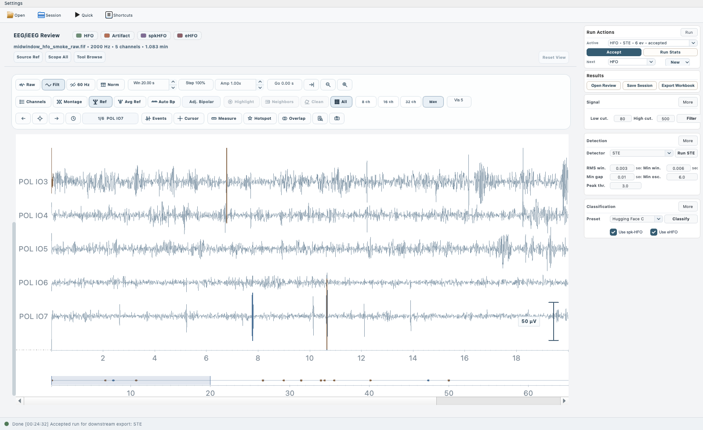

# PyHFO


[](LICENSE.txt)
[](https://www.python.org/downloads/)
[](https://github.com/roychowdhuryresearch/pyHFO/releases)

[Project Page](https://roychowdhuryresearch.github.io/PyHFO_Project_Page/) |
[Releases](https://github.com/roychowdhuryresearch/pyHFO/releases) |
[Manual](MANUAL.md)

PyHFO is a desktop EEG review workspace for high-frequency oscillation (HFO) analysis, spindle review, and related clinical event workflows. The current application combines data loading, filtering, detection, classification, event review, session persistence, and report export in one PyQt-based interface.

## What the current app does

- Load EEG recordings from EDF, BrainVision, FIF, and FIF.GZ files.
- Run HFO detection with STE, MNI, or HIL detectors.
- Run spindle detection with YASA when the optional dependency is available.
- Review runs side by side, compare overlap, and accept a preferred run.
- Classify events with artifact, spkHFO, and eHFO models.
- Open a dedicated annotation window for event-by-event review.
- Save and restore full analysis sessions.
- Export Excel summaries, event tables, and shareable HTML report bundles.

The current workspace is broader than the older README described: it is no longer just an EDF-oriented HFO detector window.

## Supported inputs and outputs

### Recording formats

- `.edf`
- BrainVision triplets: `.vhdr`, `.eeg`, `.vmrk`
- `.fif`
- `.fif.gz`

### Session formats

- `.pybrain` for the current session format
- `.npz` for legacy session compatibility

### Export formats

- Excel workbooks
- CSV event exports
- HTML report bundles with linked assets
- Waveform snapshots

Note: some UI labels and session file extensions still use the historical `PyBrain` name for backward compatibility.

## Main workflows

### 1. Full workspace

Use the main window when you want to load a recording, create multiple runs, compare them, review channels and waveforms, annotate events, and export final outputs.

Typical HFO workflow:

1. Open a recording.
2. Filter the signal.
3. Run one or more detectors such as STE, MNI, or HIL.
4. Optionally classify the active run with artifact, spkHFO, and eHFO models.
5. Review events in the annotation window.
6. Accept the preferred run.
7. Save a session or export a report.

### 2. Quick Detection

Use Quick Detection for a faster HFO-only path when you want to open a recording, choose one detector, optionally run classification, and export results without using the full workspace.

Quick Detection currently supports:

- STE, MNI, and HIL detectors
- Optional classifier execution
- Excel export
- Session export

### 3. Biomarker modes

The main workspace supports multiple biomarker modes:

- `HFO`: full detection, classification, review, and export workflow
- `Spindle`: YASA-based detection plus artifact/spike review workflow
- `Spike`: review/import-oriented workflow; automated spike detection is not the current focus

## Classification models

PyHFO can use either local checkpoint paths or hosted Hugging Face model cards for classifier sources.

The default presets are configured around:

- `roychowdhuryresearch/HFO-artifact`
- `roychowdhuryresearch/HFO-spkHFO`
- `roychowdhuryresearch/HFO-eHFO`

If you use the hosted presets, the first run may download model assets from Hugging Face.

## Installation

### Option 1: Standalone release

End users should prefer the packaged builds from [GitHub Releases](https://github.com/roychowdhuryresearch/pyHFO/releases).

#### macOS

If you download the macOS app bundle:

1. Download and unzip the release archive.
2. Open Terminal in the folder containing `pyHFO.dmg`.
3. Remove the quarantine attribute:

```bash
xattr -cr pyHFO.dmg
```

4. Open the DMG and drag PyHFO into Applications.

### Option 2: Run from source

PyHFO is currently developed and tested around Python 3.9.

```bash
git clone https://github.com/roychowdhuryresearch/pyHFO.git
cd pyHFO
python3.9 -m venv .venv
source .venv/bin/activate
pip install --upgrade pip
pip install -r requirements.txt
python main.py
```

Conda works as well if that is your preferred environment manager:

```bash
conda create -n pyhfo python=3.9
conda activate pyhfo
pip install -r requirements.txt
python main.py
```

### Option 3: Build release packages

The repository now separates runtime, development, and release-build dependencies:

- `requirements.txt`: runtime dependencies for running from source
- `requirements-dev.txt`: runtime dependencies plus test tooling
- `requirements-release-macos.txt`: runtime dependencies plus `py2app`
- `requirements-release-windows.txt`: runtime dependencies plus `PyInstaller`

#### Build a macOS app bundle

Run this on macOS:

```bash
python3.9 -m venv .venv
source .venv/bin/activate
pip install --upgrade pip
pip install -r requirements-release-macos.txt
python macos_package.py
```

This produces a `.app` bundle under `dist/`.

#### Build a Windows release folder

Run this on a Windows machine:

```powershell
py -3.9 -m venv .venv
.venv\Scripts\Activate.ps1
python -m pip install --upgrade pip
pip install -r requirements-release-windows.txt
python windows_package.py
```

This produces a distributable `dist/PyHFO/` folder. Zip that folder before uploading it to a GitHub release.

Note: desktop app packaging is not cross-platform here. Build macOS artifacts on macOS and Windows artifacts on Windows.

## Quick start

1. Launch the app with `python main.py` or the packaged desktop build.
2. Open an EEG recording.
3. Choose `HFO`, `Spindle`, or `Spike` mode as needed.
4. Configure filtering and detector parameters.
5. Run detection.
6. Optionally run classification on the active run.
7. Open the review window to inspect and relabel events.
8. Save a `.pybrain` session or export a workbook/report.

The current main workspace is shown below:



For detailed operator instructions, refer to the [manual](MANUAL.md).

## Development

Install development dependencies with:

```bash
pip install -r requirements-dev.txt
```

### Run tests

```bash
pytest -q
```

### Optional smoke tests

The repository includes heavier smoke tests that are opt-in:

```bash
PYHFO_RUN_SMOKE=1 pytest -q tests/test_backend_smoke.py tests/test_app_smoke.py
```

These smoke tests expect the repository sample assets to be present and may require optional runtime dependencies such as `torch`.

## Troubleshooting

### PyQt install issues

If your environment has trouble resolving Qt packages, upgrade `pip` first and reinstall from `requirements.txt`:

```bash
pip install --upgrade pip
pip install -r requirements.txt --force-reinstall
```

### Missing spindle detection

Spindle detection depends on `yasa`. If it is missing, the UI will still load, but the YASA workflow will remain unavailable until that package is installed.

### Hosted classifier download failures

If the default classifier presets cannot download, either:

- confirm internet access for Hugging Face downloads, or
- switch the classifier sources to local checkpoint files

### Large recordings

Large EEG studies can consume substantial RAM. If the UI becomes sluggish, reduce the loaded recording size, close other applications, or prefer the full workspace over repeated ad hoc exports.

## Citation

If PyHFO is useful in your research, please cite:

```bibtex
@article{ding2025pyhfo,
  title={PyHFO 2.0: An open-source platform for deep learning-based clinical high-frequency oscillations analysis},
  author={Ding, Y. and Zhang, Y. and Duan, C. and Daida, A. and Zhang, Y. and Kanai, S. and Lu, M. and Hussain, S. and Staba, R. J. and Nariai, H. and Roychowdhury, V.},
  journal={Journal of Neural Engineering},
  volume={22},
  number={5},
  pages={056040},
  year={2025},
  doi={10.1088/1741-2552/ae10e0}
}

@article{zhang2024pyhfo,
  title={PyHFO: lightweight deep learning-powered end-to-end high-frequency oscillations analysis application},
  author={Zhang, Y. and Liu, L. and Ding, Y. and Chen, X. and Monsoor, T. and Daida, A. and Oana, S. and Hussain, S. A. and Sankar, R. and Fallah, A. and Santana-Gomez, C. and Engel, J. and Staba, R. J. and Speier, W. and Zhang, J. and Nariai, H. and Roychowdhury, V.},
  journal={Journal of Neural Engineering},
  year={2024},
  doi={10.1088/1741-2552/ad4916}
}
```

## Related projects

- [HFODetector](https://github.com/roychowdhuryresearch/HFO_Detector) - Python toolbox for fast HFO detection.
- [HFO-Classification](https://github.com/roychowdhuryresearch/HFO-Classification) - Deep learning projects for HFO classification.
- [EEG-Viz](https://github.com/jebbica/EEG-Viz) - EEG visualization toolkit.

## License

This project is licensed under the UCLA Academic License. See [LICENSE.txt](LICENSE.txt).

## Contact and support

- Issues: [GitHub Issues](https://github.com/roychowdhuryresearch/pyHFO/issues)
- Discussions: [GitHub Discussions](https://github.com/roychowdhuryresearch/pyHFO/discussions)
- Documentation: [User manual](MANUAL.md)
- Project site: [PyHFO Project Page](https://roychowdhuryresearch.github.io/PyHFO_Project_Page/)

For academic collaboration questions, contact Prof. Vwani Roychowdhury through UCLA ECE.

## Acknowledgments

This project is supervised by Prof. [Vwani Roychowdhury](https://www.ee.ucla.edu/vwani-p-roychowdhury/).

Department of Electrical and Computer Engineering, University of California, Los Angeles

- [Yipeng Zhang](https://zyp5511.github.io/)
- [Lawrence Liu](https://www.linkedin.com/in/lawrence-liu-0a01391a7/)
- [Yuanyi Ding](https://www.linkedin.com/in/yuanyi-ding-4a981a132/)
- [Xin Chen](https://www.linkedin.com/in/xin-chen-980521/)
- [Jessica Lin](https://www.linkedin.com/in/jessica4903/)
- [Mingjian Lu](https://www.linkedin.com/in/mingjian-lu-357182102/)
- [Lucas Lu](https://www.linkedin.com/in/lucas-lu-93b867278/)

Division of Pediatric Neurology, Department of Pediatrics, UCLA Mattel Children's Hospital David Geffen School of Medicine

- [Hiroki Nariai](https://www.uclahealth.org/providers/hiroki-nariai)
